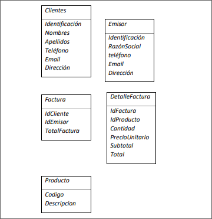
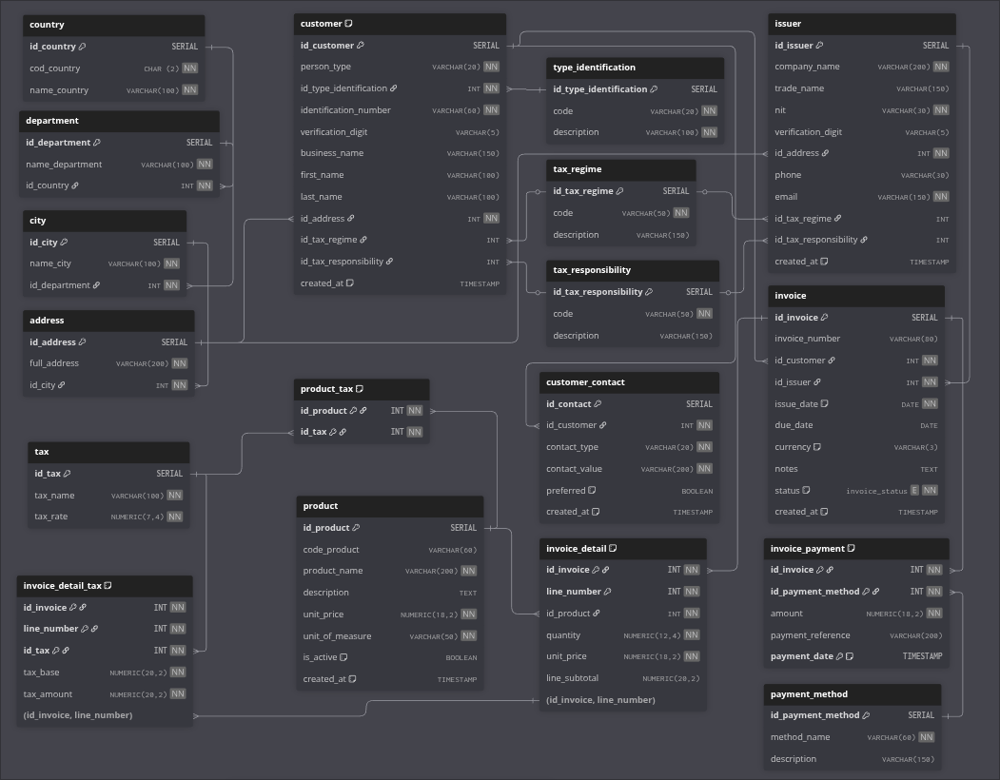

# PRUEBA TECNICA CONEXUS-IT


---
## 1. Prueba de conocimiento

-   **A ¿Cuál es el objetivo o funcionalidad del lenguaje XML?**
    ``` bash
    Extensible Markup Language (XML)
    
    Objetivo: permite de forma jerarquica y flexible presentar datos 
    estructurados y facilita el intercambio de informacion en la web 
    independiente del lenguaje de programacion o sistema operativo, 
    derivado de SGML y es complementario de HTML

    Funcionalidad: 
    - etiquetas personalizadas
    - estructura jerarquica
    - intercambio de datos entre aplicaciones
    ```
-   **B ¿Cuál es la diferencia entre un servicio Api/REST y uno WCF??**
    ``` bash

    la principal diferencia es WCF se utiliza para entornos microsoft 
    complejos, es mas antiguo y pesado. Se utiliza en entornos 
    empresariales Internos; REST es universal, moderno y ligero. 
    Compatible con cualquier dispositivo.
    ```

-   **C ¿Para qué casos sería recomendable usar una vista y no una tabla de la base de datos?**
    ``` bash 
    - simplifica consultas complejas 
    - permite otorgar permisos de acceso a informacion sensible
    - presentacion de datos de forma mas coherente, extrayendo la informacion necesaria
    - reutilizacion de logica para no repetir consultas complejas
    - optimizacion donde se reduce el tiempo de consultas repetidas
    - analisis o informes 
    ```
-   **D ¿Cuál es el Objetivo o funcionalidad de una petición Json?**
    ``` bash
    intercambio bidireccional y seguro de datos entre servidores

    - no envia ni recibe cookies ni autenticacion HTTP
    -solo trabaja con JSON 
    -especifica errores y retardos
    ```

## 2. Script de base de datos

Escriba un script que permita crear una base de datos con la siguiente estructura
(Incluir Llaves primarias y foráneas)



Las relaciones entre las tablas serán las siguientes
• Una Factura debe estar relacionada con un Cliente
• Una Factura debe estar relacionada con un Emisor
• Una Factura mínimo debe tener relacionado un detalleFactura
• Cada detalleFactura debe estar relacionada con un Producto


### creación base de datos

``` sql
CREATE DATABASE billing_system
```

### Tablas de Direccion 

``` sql
CREATE TABLE IF NOT EXISTS country (
    id_country      SERIAL PRIMARY KEY,
    cod_country     CHAR(2) NOT NULL UNIQUE,    
    name_country    VARCHAR(100) NOT NULL
);

CREATE TABLE IF NOT EXISTS department (
    id_department   SERIAL PRIMARY KEY,
    name_department VARCHAR(100) NOT NULL,
    id_country      INT NOT NULL REFERENCES country(id_country)
);

CREATE TABLE IF NOT EXISTS city (
    id_city         SERIAL PRIMARY KEY,
    name_city       VARCHAR(100) NOT NULL,
    id_department   INT NOT NULL REFERENCES department(id_department)
);

CREATE TABLE IF NOT EXISTS address (
    id_address      SERIAL PRIMARY KEY,
    full_address    VARCHAR(200) NOT NULL,
    id_city         INT NOT NULL REFERENCES city(id_city)
);
```

### Tablas de Tipos

``` sql
CREATE TABLE IF NOT EXISTS type_identification (
    id_type_identification SERIAL PRIMARY KEY,
    code VARCHAR(20) NOT NULL UNIQUE, 
    description VARCHAR(100) NOT NULL
);

CREATE TABLE IF NOT EXISTS tax_regime (
    id_tax_regime   SERIAL PRIMARY KEY,
    code VARCHAR(50) NOT NULL UNIQUE,
    description VARCHAR(150)
);

CREATE TABLE IF NOT EXISTS tax_responsibility (
    id_tax_responsibility SERIAL PRIMARY KEY,
    code VARCHAR(50) NOT NULL UNIQUE,  
    description VARCHAR(150)
);

CREATE TABLE IF NOT EXISTS payment_method (
    id_payment_method SERIAL PRIMARY KEY,
    method_name VARCHAR(60) NOT NULL UNIQUE, 
    description VARCHAR(150)
);
```

### Tablas Cliente

``` sql
CREATE TABLE IF NOT EXISTS customer (
    id_customer         SERIAL PRIMARY KEY,
    person_type         VARCHAR(20) NOT NULL CHECK (person_type IN ('natural', 'juridica')),
    id_type_identification INT NOT NULL REFERENCES type_identification(id_type_identification),
    identification_number   VARCHAR(60) NOT NULL,
    verification_digit      VARCHAR(5), 
    business_name           VARCHAR(150),
    first_name              VARCHAR(100), 
    last_name               VARCHAR(100),
    id_address              INT NOT NULL REFERENCES address(id_address),
    id_tax_regime           INT REFERENCES tax_regime(id_tax_regime),
    id_tax_responsibility   INT REFERENCES tax_responsibility(id_tax_responsibility),
    created_at              TIMESTAMP DEFAULT CURRENT_TIMESTAMP,
    CONSTRAINT uniq_customer_identification UNIQUE (id_type_identification, identification_number)
);

CREATE TABLE IF NOT EXISTS customer_contact (
    id_contact      SERIAL PRIMARY KEY,
    id_customer     INT NOT NULL REFERENCES customer(id_customer) ON DELETE CASCADE,
    contact_type    VARCHAR(20) NOT NULL CHECK (contact_type IN ('email','phone','other')),
    contact_value   VARCHAR(200) NOT NULL,
    preferred       BOOLEAN DEFAULT FALSE,
    created_at      TIMESTAMP DEFAULT CURRENT_TIMESTAMP
);
```

### Tablas Emisor

``` sql
CREATE TABLE IF NOT EXISTS issuer (
    id_issuer           SERIAL PRIMARY KEY,
    company_name        VARCHAR(200) NOT NULL,
    trade_name          VARCHAR(150),
    nit                 VARCHAR(30) NOT NULL UNIQUE,
    verification_digit  VARCHAR(5),
    id_address          INT NOT NULL REFERENCES address(id_address),
    phone               VARCHAR(30),
    email               VARCHAR(150) NOT NULL,
    id_tax_regime       INT REFERENCES tax_regime(id_tax_regime),
    id_tax_responsibility INT REFERENCES tax_responsibility(id_tax_responsibility),
    created_at          TIMESTAMP DEFAULT CURRENT_TIMESTAMP
);
```

### Tablas de Productos

``` sql
CREATE TABLE IF NOT EXISTS product (
    id_product      SERIAL PRIMARY KEY,
    code_product    VARCHAR(60) UNIQUE,
    product_name    VARCHAR(200) NOT NULL,
    description     TEXT,
    unit_price      NUMERIC(18,2) NOT NULL CHECK (unit_price >= 0),
    unit_of_measure VARCHAR(50) NOT NULL,
    is_active       BOOLEAN DEFAULT TRUE,
    created_at      TIMESTAMP DEFAULT CURRENT_TIMESTAMP
);

CREATE TABLE IF NOT EXISTS tax (
    id_tax      SERIAL PRIMARY KEY,
    tax_name    VARCHAR(100) NOT NULL,
    tax_rate    NUMERIC(7,4) NOT NULL CHECK (tax_rate >= 0)
);

CREATE TABLE IF NOT EXISTS product_tax (
    id_product  INT NOT NULL REFERENCES product(id_product) ON DELETE CASCADE,
    id_tax      INT NOT NULL REFERENCES tax(id_tax) ON DELETE CASCADE,
    PRIMARY KEY (id_product, id_tax)
);
```

### Tablas de Factura

``` sql
CREATE TYPE invoice_status AS ENUM ('draft','final','cancelled');

CREATE TABLE IF NOT EXISTS invoice (
    id_invoice      SERIAL PRIMARY KEY,
    invoice_number  VARCHAR(80) UNIQUE, 
    id_customer     INT NOT NULL REFERENCES customer(id_customer),
    id_issuer       INT NOT NULL REFERENCES issuer(id_issuer),
    issue_date      DATE NOT NULL DEFAULT CURRENT_DATE,
    due_date        DATE,
    currency        VARCHAR(3) DEFAULT 'COP',
    notes           TEXT,
    status          invoice_status NOT NULL DEFAULT 'draft',
    created_at      TIMESTAMP DEFAULT CURRENT_TIMESTAMP
);
```

### Tablas de Detalle Factura

``` sql

CREATE TABLE IF NOT EXISTS invoice_detail (
    id_invoice      INT NOT NULL REFERENCES invoice(id_invoice) ON DELETE CASCADE,
    line_number     INT NOT NULL,
    id_product      INT NOT NULL REFERENCES product(id_product),
    quantity        NUMERIC(12,4) NOT NULL CHECK (quantity > 0),
    unit_price      NUMERIC(18,2) NOT NULL CHECK (unit_price >= 0),
    line_subtotal   NUMERIC(20,2) GENERATED ALWAYS AS (quantity * unit_price) STORED,
    PRIMARY KEY (id_invoice, line_number)
);

CREATE TABLE IF NOT EXISTS invoice_detail_tax (
    id_invoice      INT NOT NULL,
    line_number     INT NOT NULL,
    id_tax          INT NOT NULL,
    tax_base        NUMERIC(20,2) NOT NULL,
    tax_amount      NUMERIC(20,2) NOT NULL,
    PRIMARY KEY (id_invoice, line_number, id_tax),
    FOREIGN KEY (id_invoice, line_number) REFERENCES invoice_detail(id_invoice, line_number) ON DELETE CASCADE,
    FOREIGN KEY (id_tax) REFERENCES tax(id_tax) ON DELETE RESTRICT
);

CREATE TABLE IF NOT EXISTS invoice_payment (
    id_invoice          INT NOT NULL REFERENCES invoice(id_invoice) ON DELETE CASCADE,
    id_payment_method   INT NOT NULL REFERENCES payment_method(id_payment_method),
    amount              NUMERIC(18,2) NOT NULL CHECK (amount >= 0),
    payment_reference   VARCHAR(200),
    payment_date        TIMESTAMP DEFAULT CURRENT_TIMESTAMP,
    PRIMARY KEY (id_invoice, id_payment_method, payment_date)
);

```

### Diagrama DB 



se realiza normalizacion de DB hasta su 4FN incluyendo campos necesarios y requeridos por la DIAN para la manejo de informacion contable.

## Autor
[Jorge Andres Cristancho Olarte](https://github.com/jcristancho2)

