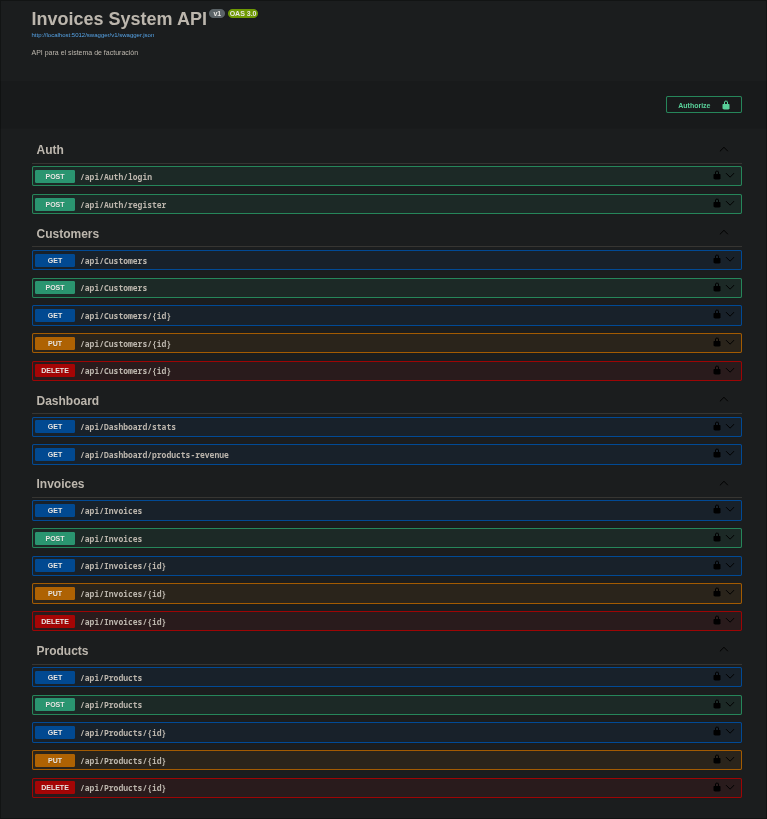

# Sistema de Facturación Conexus IT


Sistema completo de facturación desarrollado con .NET Core 9.0 en el backend y React + Vite en el frontend, con soporte completo para Docker.

---

## 📋 Tabla de Contenidos

- [Características](#-características)
- [Requisitos Previos](#-requisitos-previos)
- [Instalación](#-instalación)
  - [Instalación Local](#instalación-local)
  - [Instalación con Docker](#instalación-con-docker)
- [Configuración](#-configuración)
- [Uso](#-uso)
- [Pruebas de Endpoints](#-pruebas-de-endpoints)
  - [Diagrama de Endpoints](#diagrama-de-endpoints)
- [Capturas de Pantalla de la Aplicación](#-capturas-de-pantalla-de-la-aplicación)
- [Frontend](#-frontend)
- [Estructura del Proyecto](#-estructura-del-proyecto)
- [Tecnologías Utilizadas](#-tecnologías-utilizadas)

---
## 1. Prueba de conocimiento

-   **A ¿Cuál es el objetivo o funcionalidad del lenguaje XML?**
    ``` bash
    Extensible Markup Language (XML)
    
    Objetivo: permite de forma jerarquica y flexible presentar datos 
    estructurados y facilita el intercambio de informacion en la web 
    independiente del lenguaje de programacion o sistema operativo, 
    derivado de SGML y es complementario de HTML

    Funcionalidad: 
    - etiquetas personalizadas
    - estructura jerarquica
    - intercambio de datos entre aplicaciones
    ```
-   **B ¿Cuál es la diferencia entre un servicio Api/REST y uno WCF??**
    ``` bash

    la principal diferencia es WCF se utiliza para entornos microsoft 
    complejos, es mas antiguo y pesado. Se utiliza en entornos 
    empresariales Internos; REST es universal, moderno y ligero. 
    Compatible con cualquier dispositivo.
    ```

-   **C ¿Para qué casos sería recomendable usar una vista y no una tabla de la base de datos?**
    ``` bash 
    - simplifica consultas complejas 
    - permite otorgar permisos de acceso a informacion sensible
    - presentacion de datos de forma mas coherente, extrayendo la informacion necesaria
    - reutilizacion de logica para no repetir consultas complejas
    - optimizacion donde se reduce el tiempo de consultas repetidas
    - analisis o informes 
    ```
-   **D ¿Cuál es el Objetivo o funcionalidad de una petición Json?**
    ``` bash
    intercambio bidireccional y seguro de datos entre servidores

    - no envia ni recibe cookies ni autenticacion HTTP
    -solo trabaja con JSON 
    -especifica errores y retardos
    ```

## 2. 📊 Diagramas de Base de Datos

Escriba un script que permita crear una base de datos con la siguiente estructura
(Incluir Llaves primarias y foráneas)

### Diagrama V1 (Sin Normalizar)
<div align="center">
  
</div>


``` txt
Las relaciones entre las tablas serán las siguientes 
• Una Factura debe estar relacionada con un Cliente
• Una Factura debe estar relacionada con un Emisor
• Una Factura mínimo debe tener relacionado un detalleFactura
• Cada detalleFactura debe estar relacionada con un Producto
```


### Creación base de datos

``` sql
CREATE DATABASE billing_system
```

### Tablas de Direccion 

``` sql
CREATE TABLE IF NOT EXISTS country (
    id_country      SERIAL PRIMARY KEY,
    cod_country     CHAR(2) NOT NULL UNIQUE,    
    name_country    VARCHAR(100) NOT NULL
);

CREATE TABLE IF NOT EXISTS department (
    id_department   SERIAL PRIMARY KEY,
    name_department VARCHAR(100) NOT NULL,
    id_country      INT NOT NULL REFERENCES country(id_country)
);

CREATE TABLE IF NOT EXISTS city (
    id_city         SERIAL PRIMARY KEY,
    name_city       VARCHAR(100) NOT NULL,
    id_department   INT NOT NULL REFERENCES department(id_department)
);

CREATE TABLE IF NOT EXISTS address (
    id_address      SERIAL PRIMARY KEY,
    full_address    VARCHAR(200) NOT NULL,
    id_city         INT NOT NULL REFERENCES city(id_city)
);
```

### Tablas de Tipos

``` sql
CREATE TABLE IF NOT EXISTS type_identification (
    id_type_identification SERIAL PRIMARY KEY,
    code VARCHAR(20) NOT NULL UNIQUE, 
    description VARCHAR(100) NOT NULL
);

CREATE TABLE IF NOT EXISTS tax_regime (
    id_tax_regime   SERIAL PRIMARY KEY,
    code VARCHAR(50) NOT NULL UNIQUE,
    description VARCHAR(150)
);

CREATE TABLE IF NOT EXISTS tax_responsibility (
    id_tax_responsibility SERIAL PRIMARY KEY,
    code VARCHAR(50) NOT NULL UNIQUE,  
    description VARCHAR(150)
);

CREATE TABLE IF NOT EXISTS payment_method (
    id_payment_method SERIAL PRIMARY KEY,
    method_name VARCHAR(60) NOT NULL UNIQUE, 
    description VARCHAR(150)
);
```

### Tablas Cliente

``` sql
CREATE TABLE IF NOT EXISTS customer (
    id_customer         SERIAL PRIMARY KEY,
    person_type         VARCHAR(20) NOT NULL CHECK (person_type IN ('natural', 'juridica')),
    id_type_identification INT NOT NULL REFERENCES type_identification(id_type_identification),
    identification_number   VARCHAR(60) NOT NULL,
    verification_digit      VARCHAR(5), 
    business_name           VARCHAR(150),
    first_name              VARCHAR(100), 
    last_name               VARCHAR(100),
    id_address              INT NOT NULL REFERENCES address(id_address),
    id_tax_regime           INT REFERENCES tax_regime(id_tax_regime),
    id_tax_responsibility   INT REFERENCES tax_responsibility(id_tax_responsibility),
    created_at              TIMESTAMP DEFAULT CURRENT_TIMESTAMP,
    CONSTRAINT uniq_customer_identification UNIQUE (id_type_identification, identification_number)
);

CREATE TABLE IF NOT EXISTS customer_contact (
    id_contact      SERIAL PRIMARY KEY,
    id_customer     INT NOT NULL REFERENCES customer(id_customer) ON DELETE CASCADE,
    contact_type    VARCHAR(20) NOT NULL CHECK (contact_type IN ('email','phone','other')),
    contact_value   VARCHAR(200) NOT NULL,
    preferred       BOOLEAN DEFAULT FALSE,
    created_at      TIMESTAMP DEFAULT CURRENT_TIMESTAMP
);
```

### Tablas Emisor

``` sql
CREATE TABLE IF NOT EXISTS issuer (
    id_issuer           SERIAL PRIMARY KEY,
    company_name        VARCHAR(200) NOT NULL,
    trade_name          VARCHAR(150),
    nit                 VARCHAR(30) NOT NULL UNIQUE,
    verification_digit  VARCHAR(5),
    id_address          INT NOT NULL REFERENCES address(id_address),
    phone               VARCHAR(30),
    email               VARCHAR(150) NOT NULL,
    id_tax_regime       INT REFERENCES tax_regime(id_tax_regime),
    id_tax_responsibility INT REFERENCES tax_responsibility(id_tax_responsibility),
    created_at          TIMESTAMP DEFAULT CURRENT_TIMESTAMP
);
```

### Tablas de Productos

``` sql
CREATE TABLE IF NOT EXISTS product (
    id_product      SERIAL PRIMARY KEY,
    code_product    VARCHAR(60) UNIQUE,
    product_name    VARCHAR(200) NOT NULL,
    description     TEXT,
    unit_price      NUMERIC(18,2) NOT NULL CHECK (unit_price >= 0),
    unit_of_measure VARCHAR(50) NOT NULL,
    is_active       BOOLEAN DEFAULT TRUE,
    created_at      TIMESTAMP DEFAULT CURRENT_TIMESTAMP
);

CREATE TABLE IF NOT EXISTS tax (
    id_tax      SERIAL PRIMARY KEY,
    tax_name    VARCHAR(100) NOT NULL,
    tax_rate    NUMERIC(7,4) NOT NULL CHECK (tax_rate >= 0)
);

CREATE TABLE IF NOT EXISTS product_tax (
    id_product  INT NOT NULL REFERENCES product(id_product) ON DELETE CASCADE,
    id_tax      INT NOT NULL REFERENCES tax(id_tax) ON DELETE CASCADE,
    PRIMARY KEY (id_product, id_tax)
);
```

### Tablas de Factura

``` sql
CREATE TYPE invoice_status AS ENUM ('draft','final','cancelled');

CREATE TABLE IF NOT EXISTS invoice (
    id_invoice      SERIAL PRIMARY KEY,
    invoice_number  VARCHAR(80) UNIQUE, 
    id_customer     INT NOT NULL REFERENCES customer(id_customer),
    id_issuer       INT NOT NULL REFERENCES issuer(id_issuer),
    issue_date      DATE NOT NULL DEFAULT CURRENT_DATE,
    due_date        DATE,
    currency        VARCHAR(3) DEFAULT 'COP',
    notes           TEXT,
    status          invoice_status NOT NULL DEFAULT 'draft',
    created_at      TIMESTAMP DEFAULT CURRENT_TIMESTAMP
);
```

### Tablas de Detalle Factura

``` sql

CREATE TABLE IF NOT EXISTS invoice_detail (
    id_invoice      INT NOT NULL REFERENCES invoice(id_invoice) ON DELETE CASCADE,
    line_number     INT NOT NULL,
    id_product      INT NOT NULL REFERENCES product(id_product),
    quantity        NUMERIC(12,4) NOT NULL CHECK (quantity > 0),
    unit_price      NUMERIC(18,2) NOT NULL CHECK (unit_price >= 0),
    line_subtotal   NUMERIC(20,2) GENERATED ALWAYS AS (quantity * unit_price) STORED,
    PRIMARY KEY (id_invoice, line_number)
);

CREATE TABLE IF NOT EXISTS invoice_detail_tax (
    id_invoice      INT NOT NULL,
    line_number     INT NOT NULL,
    id_tax          INT NOT NULL,
    tax_base        NUMERIC(20,2) NOT NULL,
    tax_amount      NUMERIC(20,2) NOT NULL,
    PRIMARY KEY (id_invoice, line_number, id_tax),
    FOREIGN KEY (id_invoice, line_number) REFERENCES invoice_detail(id_invoice, line_number) ON DELETE CASCADE,
    FOREIGN KEY (id_tax) REFERENCES tax(id_tax) ON DELETE RESTRICT
);

CREATE TABLE IF NOT EXISTS invoice_payment (
    id_invoice          INT NOT NULL REFERENCES invoice(id_invoice) ON DELETE CASCADE,
    id_payment_method   INT NOT NULL REFERENCES payment_method(id_payment_method),
    amount              NUMERIC(18,2) NOT NULL CHECK (amount >= 0),
    payment_reference   VARCHAR(200),
    payment_date        TIMESTAMP DEFAULT CURRENT_TIMESTAMP,
    PRIMARY KEY (id_invoice, id_payment_method, payment_date)
);

```
### Diagrama V2 (4FN)
<div align="center">
  
</div>

se realiza normalizacion de DB hasta su 4FN incluyendo campos necesarios y requeridos por la DIAN para la manejo de informacion contable.

---

## ✨ Características

### Backend
- ✅ API RESTful con .NET Core 9.0
- ✅ Autenticación JWT
- ✅ Entity Framework Core con PostgreSQL
- ✅ Arquitectura en capas (Repository, Service, Controller)
- ✅ AutoMapper para mapeo de DTOs
- ✅ Swagger/OpenAPI para documentación
- ✅ Migraciones automáticas de base de datos
- ✅ Manejo centralizado de excepciones

### Frontend
- ✅ React 19 + Vite
- ✅ React Router DOM para navegación
- ✅ Tailwind CSS para estilos
- ✅ Tema claro/oscuro
- ✅ PWA (Progressive Web App)
- ✅ Responsive design
- ✅ Gráficos con Recharts
- ✅ Autenticación con JWT

### Funcionalidades
- 📄 Gestión completa de facturas (CRUD)
- 👥 Gestión de clientes
- 📦 Gestión de productos
- 📊 Dashboard con estadísticas y gráficos
- 🔍 Búsqueda y filtrado avanzado
- 📱 Interfaz responsive y PWA

---

## 🔧 Requisitos Previos

### Para Desarrollo Local
- **.NET SDK 9.0** o superior
- **Node.js 20** o superior y npm
- **PostgreSQL 16** o superior
- **Git**

### Para Docker
- **Docker** 20.10 o superior
- **Docker Compose** 2.0 o superior

---

## 📦 Instalación

### Instalación Local

#### 1. Clonar el Repositorio
```bash
git clone <repository-url>
cd Conexus_IT_PT
```

#### 2. Configurar Base de Datos

Crear la base de datos en PostgreSQL:
```sql
CREATE DATABASE billing_system;
```

Configurar la cadena de conexión en `Backend/InvoicesSystem.API/appsettings.json`:
```json
{
  "ConnectionStrings": {
    "DefaultConnection": "Host=localhost;Port=5432;Database=billing_system;Username=postgres;Password=tu_password"
  }
}
```

#### 3. Configurar Backend

```bash
cd Backend/InvoicesSystem.API

# Restaurar dependencias
dotnet restore

# Aplicar migraciones
dotnet ef database update

# Opcional: Alimentar base de datos con datos de prueba
psql -U postgres -d billing_system -f Scripts/SeedDatabase.sql
```

#### 4. Configurar Frontend

```bash
cd Frontend

# Instalar dependencias
npm install

# Crear archivo .env (opcional, usa valores por defecto)
echo "VITE_API_BASE_URL=http://localhost:5012" > .env
```

#### 5. Ejecutar la Aplicación

**Terminal 1 - Backend:**
```bash
cd Backend/InvoicesSystem.API
dotnet run
```
El backend estará disponible en: `http://localhost:5012`

**Terminal 2 - Frontend:**
```bash
cd Frontend
npm run dev
```
El frontend estará disponible en: `http://localhost:5173`

### Instalación con Docker

#### Opción 1: Docker Compose (Recomendado)

```bash
# Desde la raíz del proyecto
cd docker

# Construir y ejecutar todos los servicios
docker-compose up -d --build

# Ver logs
docker-compose logs -f

# Detener servicios
docker-compose down

# Detener y eliminar volúmenes (incluye datos de BD)
docker-compose down -v
```

**Servicios disponibles:**
- **Frontend**: http://localhost:3000
- **Backend API**: http://localhost:8081
- **Swagger**: http://localhost:8081/swagger
- **pgAdmin**: http://localhost:8080
  - Email: `admin@admin.com`
  - Password: `admin`
- **PostgreSQL**: localhost:5434

#### Opción 2: Contenedores Individuales

**Base de Datos:**
```bash
docker run -d \
  --name billing_postgres \
  -e POSTGRES_DB=billing_system \
  -e POSTGRES_USER=postgres \
  -e POSTGRES_PASSWORD=postgres \
  -p 5434:5432 \
  postgres:16
```

**Backend:**
```bash
cd Backend/InvoicesSystem.API
docker build -f Api.Dockerfile -t billing-api .
docker run -d \
  --name billing_api \
  -p 8081:8080 \
  -e ConnectionStrings__PostgresDocker="Host=billing_postgres;Port=5432;Database=billing_system;Username=postgres;Password=postgres" \
  --link billing_postgres \
  billing-api
```

**Frontend:**
```bash
cd Frontend
docker build -t billing-frontend .
docker run -d \
  --name billing_frontend \
  -p 3000:80 \
  -e VITE_API_BASE_URL=http://localhost:8081 \
  billing-frontend
```

---

## ⚙️ Configuración

### Variables de Entorno

#### Backend (`appsettings.json`)
```json
{
  "ConnectionStrings": {
    "DefaultConnection": "Host=localhost;Port=5432;Database=billing_system;Username=postgres;Password=postgres",
    "PostgresDocker": "Host=billing_postgres;Port=5432;Database=billing_system;Username=postgres;Password=postgres"
  },
  "Jwt": {
    "Key": "TuClaveSecretaMuyLargaParaJWT12345678901234567890",
    "Issuer": "InvoicesSystem.API",
    "Audience": "InvoicesSystem.Users",
    "ExpirationInMinutes": 1440
  }
}
```

#### Frontend (`.env`)
```env
VITE_API_BASE_URL=http://localhost:5012
```

### Alimentar Base de Datos

```bash
# Ejecutar script de seed
psql -U postgres -d billing_system -f Backend/InvoicesSystem.API/Scripts/SeedDatabase.sql

# Credenciales por defecto del usuario de prueba:
# Email: admin@test.com
# Password: Admin123!
```

---

## 🚀 Uso

### Acceso a la Aplicación

1. Abre el navegador en: `http://localhost:3000` (Docker) o `http://localhost:5173` (Local)
2. Inicia sesión con las credenciales:
   - **Email**: `admin@test.com`
   - **Password**: `Admin123!`

### Funcionalidades Principales

#### Gestión de Facturas
- Ver lista de facturas con paginación y filtros
- Crear nueva factura
- Editar factura existente
- Ver detalle completo de factura
- Cambiar estado de factura (Borrador → Finalizada)

#### Gestión de Clientes
- Listar clientes con búsqueda
- Crear nuevo cliente
- Ver detalles del cliente
- Editar cliente

#### Gestión de Productos
- Listar productos con búsqueda
- Crear nuevo producto
- Editar producto

#### Dashboard
- Estadísticas generales
- Gráfico de torta: Ingresos por producto
- Lista de productos más vendidos

---

## 🧪 Pruebas de Endpoints

### Autenticación

#### 1. Login
```bash
curl -X POST http://localhost:8081/api/Auth/login \
  -H "Content-Type: application/json" \
  -d '{
    "email": "admin@test.com",
    "password": "Admin123!"
  }'
```

**Respuesta esperada:**
```json
{
  "success": true,
  "message": "Inicio de sesión exitoso",
  "data": {
    "token": "eyJhbGciOiJIUzI1NiIsInR5cCI6IkpXVCJ9...",
    "user": {
      "idUser": 1,
      "email": "admin@test.com",
      "firstName": "Admin",
      "lastName": "User"
    }
  }
}
```

**Guardar el token para usar en las siguientes peticiones:**
```bash
TOKEN="tu_token_aqui"
```

#### 2. Registro (Opcional)
```bash
curl -X POST http://localhost:8081/api/Auth/register \
  -H "Content-Type: application/json" \
  -d '{
    "email": "nuevo@usuario.com",
    "password": "Password123!",
    "firstName": "Nuevo",
    "lastName": "Usuario"
  }'
```

### Facturas

#### 1. Listar Facturas
```bash
curl -X GET "http://localhost:8081/api/Invoices?page=1&pageSize=10" \
  -H "Authorization: Bearer $TOKEN"
```

#### 2. Obtener Factura por ID
```bash
curl -X GET http://localhost:8081/api/Invoices/1 \
  -H "Authorization: Bearer $TOKEN"
```

#### 3. Crear Factura
```bash
curl -X POST http://localhost:8081/api/Invoices \
  -H "Authorization: Bearer $TOKEN" \
  -H "Content-Type: application/json" \
  -d '{
    "idCustomer": 1,
    "dueDate": "2025-12-31T00:00:00Z",
    "subtotalAmount": 1000.00,
    "taxAmount": 190.00,
    "totalAmount": 1190.00,
    "status": 0,
    "notes": "Factura de prueba",
    "details": [
      {
        "idProduct": 1,
        "quantity": 2,
        "unitPrice": 500.00,
        "discountAmount": 0,
        "taxAmount": 190.00,
        "totalAmount": 1000.00
      }
    ]
  }'
```

#### 4. Actualizar Factura
```bash
curl -X PUT http://localhost:8081/api/Invoices/1 \
  -H "Authorization: Bearer $TOKEN" \
  -H "Content-Type: application/json" \
  -d '{
    "idCustomer": 1,
    "dueDate": "2025-12-31T00:00:00Z",
    "subtotalAmount": 1500.00,
    "taxAmount": 285.00,
    "totalAmount": 1785.00,
    "status": 1,
    "notes": "Factura actualizada",
    "details": [
      {
        "idProduct": 1,
        "quantity": 3,
        "unitPrice": 500.00,
        "discountAmount": 0,
        "taxAmount": 285.00,
        "totalAmount": 1500.00
      }
    ]
  }'
```

#### 5. Eliminar Factura
```bash
curl -X DELETE http://localhost:8081/api/Invoices/1 \
  -H "Authorization: Bearer $TOKEN"
```

### Clientes

#### 1. Listar Clientes
```bash
curl -X GET "http://localhost:8081/api/Customers?page=1&pageSize=10&search=Juan" \
  -H "Authorization: Bearer $TOKEN"
```

#### 2. Obtener Cliente por ID
```bash
curl -X GET http://localhost:8081/api/Customers/1 \
  -H "Authorization: Bearer $TOKEN"
```

#### 3. Crear Cliente
```bash
curl -X POST http://localhost:8081/api/Customers \
  -H "Authorization: Bearer $TOKEN" \
  -H "Content-Type: application/json" \
  -d '{
    "idTypeIdentification": 1,
    "identificationNumber": "1234567890",
    "personType": 0,
    "firstName": "Juan",
    "lastName": "Pérez",
    "idCity": 1,
    "fullAddress": "Calle 123 #45-67",
    "idTaxRegime": 1,
    "idTaxResponsibility": 1,
    "contacts": [
      {
        "contactType": 0,
        "contactValue": "juan@example.com"
      },
      {
        "contactType": 1,
        "contactValue": "3001234567"
      }
    ]
  }'
```

#### 4. Actualizar Cliente
```bash
curl -X PUT http://localhost:8081/api/Customers/1 \
  -H "Authorization: Bearer $TOKEN" \
  -H "Content-Type: application/json" \
  -d '{
    "idTypeIdentification": 1,
    "identificationNumber": "1234567890",
    "personType": 0,
    "firstName": "Juan Carlos",
    "lastName": "Pérez",
    "idCity": 1,
    "fullAddress": "Calle 123 #45-67",
    "idTaxRegime": 1,
    "idTaxResponsibility": 1
  }'
```

#### 5. Eliminar Cliente
```bash
curl -X DELETE http://localhost:8081/api/Customers/1 \
  -H "Authorization: Bearer $TOKEN"
```

### Productos

#### 1. Listar Productos
```bash
curl -X GET "http://localhost:8081/api/Products?page=1&pageSize=10&search=laptop" \
  -H "Authorization: Bearer $TOKEN"
```

#### 2. Obtener Producto por ID
```bash
curl -X GET http://localhost:8081/api/Products/1 \
  -H "Authorization: Bearer $TOKEN"
```

#### 3. Crear Producto
```bash
curl -X POST http://localhost:8081/api/Products \
  -H "Authorization: Bearer $TOKEN" \
  -H "Content-Type: application/json" \
  -d '{
    "codeProduct": "PROD001",
    "productName": "Laptop Dell",
    "description": "Laptop Dell Inspiron 15",
    "unitPrice": 1500000.00,
    "unitMeasure": "Unidad",
    "isActive": true
  }'
```

#### 4. Actualizar Producto
```bash
curl -X PUT http://localhost:8081/api/Products/1 \
  -H "Authorization: Bearer $TOKEN" \
  -H "Content-Type: application/json" \
  -d '{
    "codeProduct": "PROD001",
    "productName": "Laptop Dell (Actualizada)",
    "description": "Laptop Dell Inspiron 15 - Actualizada",
    "unitPrice": 1600000.00,
    "unitMeasure": "Unidad",
    "isActive": true
  }'
```

#### 5. Eliminar Producto
```bash
curl -X DELETE http://localhost:8081/api/Products/1 \
  -H "Authorization: Bearer $TOKEN"
```

### Dashboard

#### 1. Obtener Estadísticas
```bash
curl -X GET "http://localhost:8081/api/Dashboard/stats?startDate=2025-01-01&endDate=2025-12-31" \
  -H "Authorization: Bearer $TOKEN"
```

#### 2. Obtener Ingresos por Producto
```bash
curl -X GET "http://localhost:8081/api/Dashboard/products-revenue?startDate=2025-01-01&endDate=2025-12-31" \
  -H "Authorization: Bearer $TOKEN"
```

### Usando Swagger

1. Abre: `http://localhost:8081/swagger`
2. Haz clic en "Authorize" e ingresa: `Bearer tu_token_aqui`
3. Explora y prueba todos los endpoints desde la interfaz

### Diagrama de Endpoints

<div align="center">
  
</div>

---

## 📸 Capturas de Pantalla de la Aplicación

### Página de Login
<div align="center">
  
</div>

### Lista de Facturas
<div align="center">
  
</div>

### Detalle de Factura
<div align="center">
  
</div>

### Lista de Clientes
<div align="center">
  
</div>

### Dashboard
<div align="center">
  
</div>

---

## 💻 Frontend

### Arquitectura

El frontend está construido con **React 19** y **Vite**, siguiendo una arquitectura modular:

```
Frontend/
├── src/
│   ├── api/              # Servicios API (axios)
│   ├── components/       # Componentes reutilizables
│   ├── contexts/         # Context API (Theme)
│   ├── hooks/            # Custom hooks (useAuth)
│   ├── routes/           # Páginas y rutas
│   └── main.tsx          # Punto de entrada
```

### Funcionalidades del Frontend

#### 1. Autenticación
- **Login**: Formulario de inicio de sesión con validación
- **JWT Storage**: Token almacenado en `localStorage`
- **Protected Routes**: Rutas protegidas que requieren autenticación
- **Logout**: Cierre de sesión y limpieza de token

#### 2. Gestión de Estado
- **Context API**: Para el tema (claro/oscuro)
- **Local Storage**: Para persistencia del token y preferencias
- **React Router**: Para navegación y gestión de rutas

#### 3. Componentes Principales

**NavBar**: Barra de navegación con:
- Logo de la aplicación
- Enlaces a secciones principales
- Botón de cambio de tema
- Información del usuario
- Botón de logout

**ThemeToggle**: Botón para cambiar entre tema claro y oscuro

**Logo**: Componente reutilizable para el logo de la aplicación

#### 4. Páginas

**LoginPage** (`/login`):
- Formulario de autenticación
- Manejo de errores
- Redirección automática después del login

**InvoicesListPage** (`/invoices`):
- Lista paginada de facturas
- Filtros: búsqueda, fecha desde, total mínimo
- Acciones: Ver, Editar, Eliminar, Finalizar

**InvoiceFormPage** (`/invoices/new`, `/invoices/:id/edit`):
- Formulario para crear/editar facturas
- Selector de cliente
- Agregar/eliminar productos
- Cálculo automático de totales

**InvoiceDetailPage** (`/invoices/:id`):
- Vista detallada de factura
- Información del cliente
- Detalle de productos con precios, descuentos e impuestos
- Resumen financiero

**CustomersListPage** (`/customers`):
- Lista paginada de clientes
- Búsqueda por identificación o nombre
- Acción: Ver detalles

**CustomerFormPage** (`/customers/new`):
- Formulario para crear cliente
- Campos para persona natural/jurídica
- Gestión de contactos (email, teléfono)

**CustomerDetailPage** (`/customers/:id`):
- Vista detallada del cliente
- Información completa
- Lista de contactos

**ProductsListPage** (`/products`):
- Lista paginada de productos
- Búsqueda por código o nombre
- Estado activo/inactivo

**ProductFormPage** (`/products/new`):
- Formulario para crear producto
- Campos: código, nombre, descripción, precio, unidad de medida

**DashboardPage** (`/dashboard`):
- Gráfico de torta: Ingresos por producto
- Lista de productos más vendidos
- Estadísticas generales

#### 5. Servicios API

Todos los servicios API están en `src/api/`:

- **http.ts**: Configuración de Axios con interceptores para JWT
- **auth.ts**: Login y registro
- **invoices.ts**: CRUD de facturas
- **customers.ts**: CRUD de clientes
- **products.ts**: CRUD de productos
- **dashboard.ts**: Estadísticas y gráficos

#### 6. Tema Claro/Oscuro

- **ThemeContext**: Context API para gestión del tema
- **Persistencia**: Preferencia guardada en `localStorage`
- **Detección automática**: Respeta preferencias del sistema
- **Aplicación global**: Clases Tailwind `dark:` aplicadas automáticamente

#### 7. PWA (Progressive Web App)

- **Service Worker**: Para caché offline
- **Manifest**: Configuración de PWA
- **Instalable**: Puede instalarse como app móvil/desktop

### Scripts Disponibles

```bash
# Desarrollo
npm run dev          # Servidor de desarrollo en http://localhost:5173

# Producción
npm run build        # Compilar para producción
npm run preview      # Previsualizar build de producción

# Linting
npm run lint         # Ejecutar ESLint
```

### Variables de Entorno

Crear archivo `.env` en la raíz de `Frontend/`:

```env
VITE_API_BASE_URL=http://localhost:5012
```

---


---

## 📁 Estructura del Proyecto

```
Conexus_IT_PT/
├── Backend/
│   └── InvoicesSystem.API/
│       ├── Controllers/         # Controladores API
│       ├── Models/              # Entidades, DTOs, Enums
│       ├── Repositories/        # Capa de acceso a datos
│       ├── Services/            # Lógica de negocio
│       ├── Persistence/         # DbContext y Migraciones
│       ├── Profiles/            # AutoMapper profiles
│       ├── Middleware/          # Middleware personalizado
│       ├── Scripts/             # Scripts SQL (seed, etc.)
│       └── Program.cs           # Configuración de la aplicación
│
├── Frontend/
│   ├── src/
│   │   ├── api/                 # Servicios API
│   │   ├── components/          # Componentes React
│   │   ├── contexts/            # Context API
│   │   ├── hooks/               # Custom hooks
│   │   ├── routes/              # Páginas y rutas
│   │   └── assets/              # Recursos estáticos
│   ├── public/                  # Archivos públicos
│   └── package.json            # Dependencias
│
├── docker/
│   └── docker-compose.yml       # Configuración Docker Compose
│
├── .devcontainer/
│   └── devcontainer.json         # Configuración VS Code Dev Container
│
└── README.md                    # Este archivo
```

---

## 🛠️ Tecnologías Utilizadas

### Backend
- **.NET Core 9.0**
- **Entity Framework Core 9.0**
- **PostgreSQL 16**
- **AutoMapper**
- **JWT Authentication**
- **Swagger/OpenAPI**

### Frontend
- **React 19**
- **Vite 7**
- **TypeScript**
- **Tailwind CSS 3**
- **React Router DOM 7**
- **Axios**
- **Recharts**

### DevOps
- **Docker**
- **Docker Compose**
- **Nginx** (para frontend en producción)

---

## 📝 Notas Adicionales

### Credenciales por Defecto

**Usuario de Prueba:**
- Email: `admin@test.com`
- Password: `Admin123!`

**Base de Datos:**
- Host: `localhost` (local) / `billing_postgres` (Docker)
- Puerto: `5432` (local) / `5434` (Docker)
- Database: `billing_system`
- Usuario: `postgres`
- Password: `postgres`

### Migraciones

Las migraciones se aplican automáticamente en Docker. Para desarrollo local:

```bash
cd Backend/InvoicesSystem.API
dotnet ef database update
```

### Alimentar Base de Datos

```bash
psql -U postgres -d billing_system -f Backend/InvoicesSystem.API/Scripts/SeedDatabase.sql
```

### Solución de Problemas

**Error de conexión a la base de datos:**
- Verificar que PostgreSQL esté ejecutándose
- Verificar la cadena de conexión en `appsettings.json`
- En Docker, verificar que los servicios estén en la misma red

**Error de CORS:**
- Verificar que el backend tenga CORS configurado
- Verificar que la URL del frontend esté permitida

**Error de autenticación:**
- Verificar que el token JWT sea válido
- Verificar que el token no haya expirado
- Verificar que el header `Authorization` esté presente

---

## 👨‍💻 Autor

**Jorge Andres Cristancho Olarte**

- GitHub: [@jcristancho2](https://github.com/jcristancho2)

---

